# JSXGraph 1.13.3 Stable Test Report

This report records the evidence behind CMP JSXGraph's **Stable** rating for
the documented support scope. Independent production scenarios, generated
Native stress inputs, and the earlier development parity corpus are separate
evidence layers and are not counted as substitutes for each other.

## Decision

| Item | Result |
| --- | --- |
| Current rating | **Stable for the documented support scope** |
| JSXGraph compatibility baseline | `1.13.3` |
| Independent production scenarios | 30 |
| Declared capability coverage | 55/55 |
| Native core results | 30 production cases plus 512 generated stress inputs passed |
| Web Native/Official captures | 60: 30 Desktop plus 30 Compact |
| Automated visual parity | 60/60 passed SSIM `0.93` |
| Lowest Desktop SSIM | 0.981779, `prod_text_anchor_board` |
| Lowest Compact SSIM | 0.961778, `prod_text_opacity_caption` |
| Deterministic scene replay | 30/30 |
| Deterministic interaction replay | 8/8 |
| Generated interaction updates | 64/64 |
| Core production soak | 900 renders; 292ms total; 1.649ms P95; 0 retained bytes |
| Runtime load matrix | Android Emulator, iOS Simulator, Desktop, and Web passed |
| Android Internet permission | Not declared in debug or release APK |
| Public-source safety scan | No organization-specific endpoint or credential pattern found |

**Conclusion:** every gate in
[`production-readiness.md`](production-readiness.md) passes for the bounded
Point, Line, Segment with optional numeric or JessieCode-string fixed length,
Circle including the three-Point circumcircle form, Midpoint,
OrthogonalProjection, PerpendicularPoint, Perpendicular,
PerpendicularSegment, Curve, FunctionGraph, Plot, Polygon, Text, Arc, Sector,
Angle, and Point-interaction contract. This scope is rated **Stable**.
Untranslated JSXGraph APIs and element families remain explicitly outside the
rating.

## What This Report Proves

The source-controlled production corpus:

- parses through `JsxGraphEngine` and the translated Board/creator pipeline;
- produces finite, non-empty, deterministic `JsxGraphScene` values;
- is rendered from the same source by Native Compose Canvas and the pinned
  official JSXGraph `1.13.3` audit renderer;
- completes deterministic Point move, capture, restore, and reset scenarios;
- remains inside source-controlled parser, scene, latency, and heap budgets;
- reaches the final shared load case on Android, iOS, Desktop, and Web.

The report does not claim every legal JSXGraph program is supported. SSIM
detects visual regression but does not prove semantic equivalence by itself.
Platform font rasterization and small antialiasing differences remain
expected. Unsupported source crosses the production boundary as
`GMResult.Err` instead of being silently replaced by different geometry.

## Evidence Layers

1. **30 independent production scenarios.** Hand-authored operational boards
   used for capability coverage, deterministic replay, visual parity, runtime
   loading, and the regular Quality Gate.
2. **512 deterministic Native stress inputs.** Eight generated document
   families exercise geometry, curves, plots, polygons, text, circular
   regions, and interaction updates. These are robustness evidence, not
   official-renderer parity claims.
3. **52 development parity scenarios.** These remain focused regression
   fixtures for individual implementation batches and the source/official/
   native debug workflow.

The canonical production corpus is
[`tools/stability/production-corpus.mjs`](../tools/stability/production-corpus.mjs).
[`generate-production-corpus.mjs`](../tools/stability/generate-production-corpus.mjs)
validates IDs, source uniqueness, expected elements, interaction references,
and 55-feature coverage before generating independent Kotlin copies for core
tests and debug/runtime consumers. CI rejects generated-file drift.

## Production Corpus

| Category | Cases | Main coverage |
| --- | ---: | --- |
| Geometry | 8 | free/fixed/hidden Points, infinite and perpendicular Lines, ordinary, fixed-length, and perpendicular Segments, two-parent Circles, three-Point circumcircles, Point-pair and Line-parent Midpoints, orthogonal projection and perpendicular Points, coordinate and element parents, shifted/stretched boards |
| Curves | 4 | FunctionGraph, parametric Curve, sampled data Plot, mixed functions |
| Polygons | 4 | convex, concave, borderless, implicit and shared vertices |
| Text | 4 | static, numeric, dynamic, anchored, colored and translucent text |
| Circular regions | 6 | minor/major/clockwise and four-point direction-selected Arc, Sector, fixed and automatic Angle radius |
| Interaction | 3 | Point-driven Line, Circle, and clamped dynamic-radius updates plus state replay |
| Mixed board | 1 | Point, Segment, Circle, Polygon, Plot, and Text in one scene |

## Visual Evidence

Every page contains up to eight same-source pairs. The contact images label
each case and its measured SSIM.

### Desktop `1200 x 900`

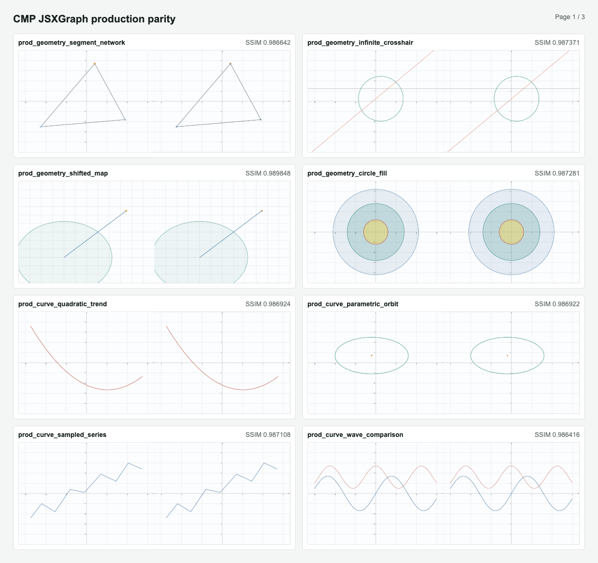

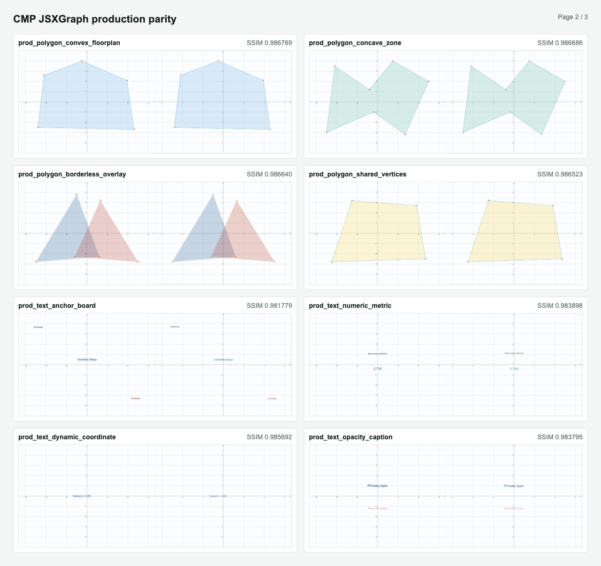

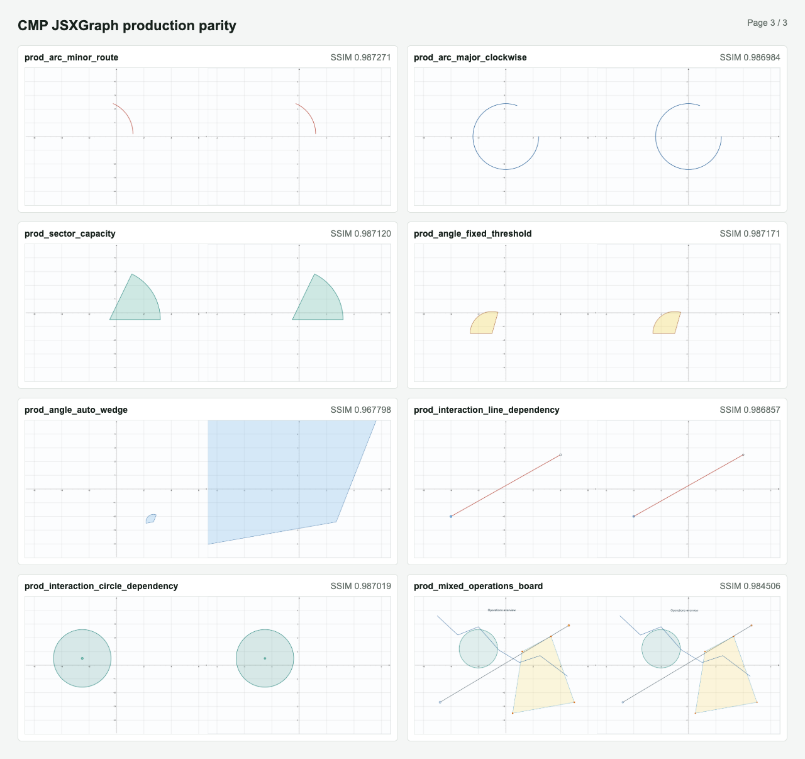

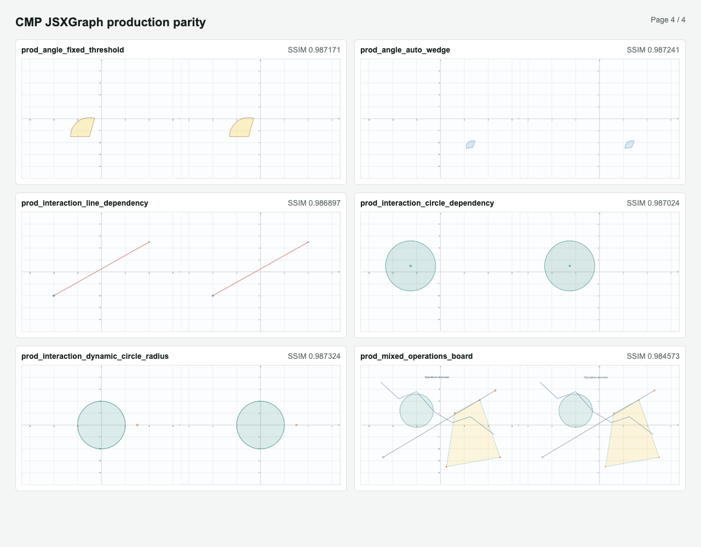

Machine-readable results:
[`production-desktop-report.json`](assets/stability-report/production-desktop-report.json).

### Compact `390 x 844`

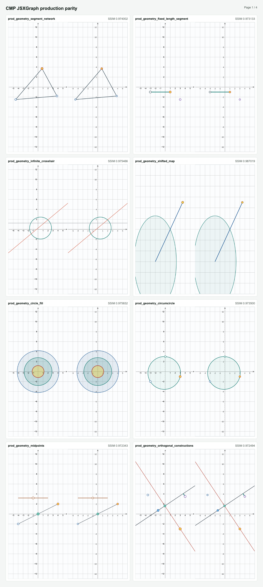

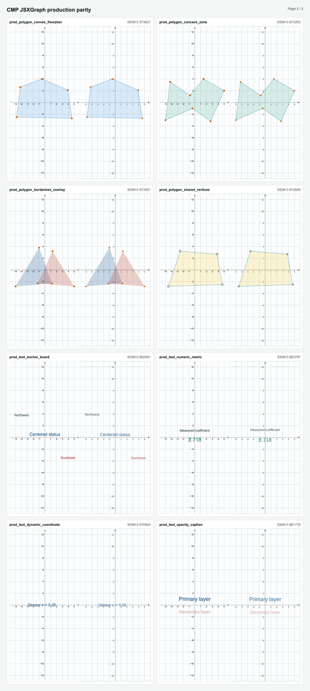

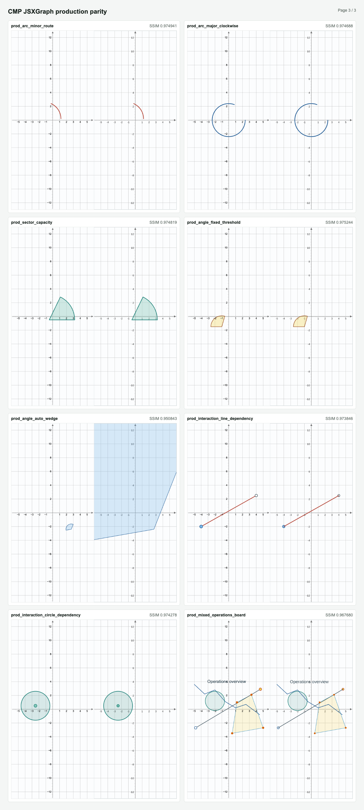

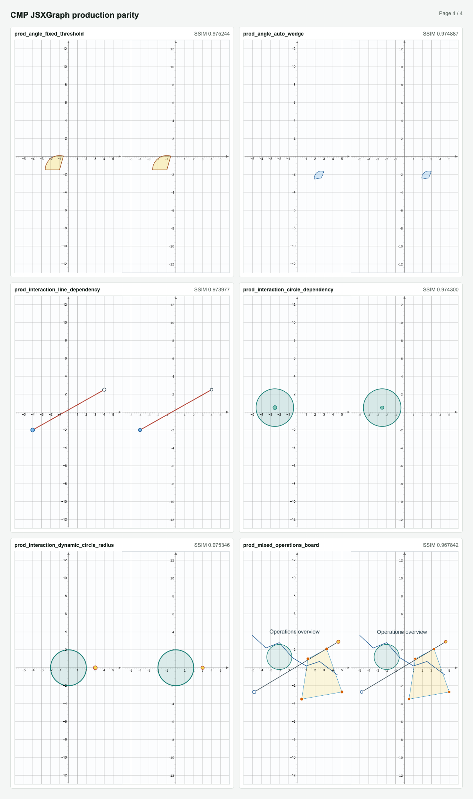

Machine-readable results:
[`production-compact-report.json`](assets/stability-report/production-compact-report.json).

All 60 pairs passed the `0.93` Stable floor. The contact pages show no missing
source element, blank board, clipping, or geometry displacement that blocks
the supported contract. The lowest remaining scores are Text cases, where
browser SVG and Compose Canvas rasterize the bundled font differently. Angle
`radius: auto` is resolved from the actual viewport CSS-pixel scale, matching
JSXGraph's `board.unitX` rule. Its geometry was manually reviewed in both
profiles and scored `0.987241` on Desktop and `0.974887` on Compact.
The dynamic fixed-length Segment case was manually reviewed and scored
`0.986731` on Desktop and `0.973133` on Compact before movement. After moving
its driver Point from `(3,-2.5)` to `(5,-2.5)`, both renderers extended the
string-defined length from `4` to `6` and scored `0.986731` and `0.972964`,
respectively. The native JessieCode function-valued form remains a focused
preview outside this Stable construction-document scope.
The production dynamic-radius Circle scored `0.987324` on Desktop and
`0.975346` on Compact before movement. After its driver Point made the string
radius negative, both renderers applied `nonnegativeOnly` and scored
`0.987084` and `0.974247`, respectively. The focused genuine JessieCode
function-radius fixture scored `0.987261` and `0.975137`; it verifies function
parents in either upstream order and remains a focused regression fixture
outside the production corpus.
The focused transformed-Point fixture scored `0.986656` on Desktop and
`0.972766` on Compact before movement. After dragging its function-driver
Point from `(2,0)` to `(5,0)`, both renderers updated the translated Point
chain and scored `0.986523` and `0.972569`, respectively. This evidence
remains outside the 30-case Stable production corpus.
The construction-document path now accepts ordered `transform` objects and
resolves their IDs in subsequent transformed-Point parents without emitting
scene elements for the transforms. The separate official
`transformation-3d.mjs` fixture covers every 4x4 matrix form and dynamic
reevaluation against JSXGraph `1.13.3`. The
`view3d-point3d.mjs` fixture then covers the bounded camera, projection,
Point3D coordinate, transformation, `applyOnce`, proxy, and removal lifecycle.
The focused `point3d_projection` visual case scored `0.986505` on Desktop and
`0.972805` on Compact before movement. After dragging the free Point3D proxy,
both renderers projected the movement to its constant-z plane and updated the
transformed Point3D with scores of `0.986588` and `0.972885`, respectively.
All four contact sheets passed manual review. The development workbench now
contains 30 production and 52 focused cases, but this does not change the
independently qualified 30-case, 60-screenshot Stable corpus.
The focused `spatial_lines_planes` fixture adds same-source Line3D, a finite
Plane3D outline with its visible Mesh3D wireframe, and Axis3D evidence. Its
static captures scored `0.987328` on Desktop and `0.975225` on Compact. Both
contact sheets passed manual review for closed outline geometry, both Mesh3D
line families, line clipping, axis arrow direction, layering, overlap, blank
output, and viewport clipping. This remains outside the Stable production
corpus.
The focused `view3d_default_axes` fixture verifies factory-owned border
Axes3D expansion, three Ticks3D curves, and 33 numeric labels from the same
construction document. Static captures scored `0.986921` on Desktop and
`0.977686` on Compact. Both contact sheets passed manual review for tick
endpoints, label order and placement, axis direction, clipping, overlap, and
blank output. This remains outside the Stable production corpus.
The focused `polyhedron3d_faces` fixture verifies six Face3D Curve proxies,
cyclic colors, a per-face override, translucent fills, borders, and ascending
local face-depth ordering from one JessieCode source. Static captures scored
`0.987380` on Desktop and `0.984777` on Compact. Both contact sheets passed
manual review for projected geometry, face closure, transparent overlays,
borders, overlap, clipping, and blank output. The official lifecycle fixture
also records a three-face/four-key definition, a four-point closed triangular
face with green `0.5` fill and `4px` stroke, an unclosed two-point face,
transformed coordinates, and dynamic base/transformed updates. This evidence
remains outside the Stable production corpus.
The focused function-coordinate Point fixture scored `0.986724` on Desktop
and `0.973162` on Compact before movement. After dragging its shared driver
from `(-3,-2)` to `(-1,1)`, the function-array, scalar-function, and
homogeneous-function Points updated with scores of `0.986769` and `0.971963`,
respectively. This evidence also remains outside the Stable production corpus.
The focused Parallel fixture scored `0.986754` on Desktop and `0.973271` on
Compact before movement. After dragging its shared parent from `(3,-3)` to
`(0,4)`, the ParallelPoint and finite/ideal lines updated with scores of
`0.986862` and `0.972748`, respectively.
The focused Parallelogram fixture scored `0.985806` on Desktop and `0.978662`
on Compact before movement. It covers the official four-edge Polygon order,
translucent fill, exposed styled ParallelPoint, and source Points. After
dragging C from `(2,-3)` to `(3,1)`, both renderers updated the helper and
Polygon with scores of `0.985679` and `0.977151`, respectively. All four
contact sheets passed nonblank/browser-error checks and manual review for
helper visibility, edge order, fill, moved geometry, clipping, and overlap.
This evidence remains outside the 30-case Stable production corpus.
The focused RegularPolygon fixture scored `0.986177` on Desktop and
`0.977920` on Compact before movement. It covers the official five-vertex
rotation chain, generated CAS helpers, nested helper styling, and source
Points. After dragging B from `(0,-2)` to `(1,0)`, both renderers updated all
dependent vertices with scores of `0.986049` and `0.976659`, respectively.
All four contact sheets passed nonblank/browser-error checks and manual review
for helper visibility, edge order, fill, moved geometry, clipping, and
overlap. This evidence remains outside the 30-case Stable production corpus.
The focused RadicalAxis fixture scored `0.986191` on Desktop and `0.982487`
on Compact before movement. It covers the two-Circle standard-form
construction, hidden constrained helper Points, and infinite Line clipping.
After dragging the first radius Point from `(-1,-1)` to `(-1,1)`, both
renderers updated the Circle and axis with scores of `0.986249` and
`0.982723`, respectively. All four contact sheets passed nonblank/browser
checks and manual review for helper leakage, Circle geometry, axis slope,
clipping, moved geometry, and overlap. This evidence remains outside the
30-case Stable production corpus.
The focused PolePoint fixture scored `0.985927` on Desktop and `0.974830` on
Compact before movement. It covers the Circle/Line determinant construction,
canonical constrained Point output, and direct parent dependencies. After
sequentially moving the Circle center and radius Point plus both Line Points
to the official fixture coordinates, both renderers moved the PolePoint from
`(5,5)` to `(2.5,-2.5)` with scores of `0.986075` and `0.963320`. All four
contact sheets passed nonblank/browser checks and manual review for Circle
radius, Line slope, Point placement, dependency propagation, clipping,
overlap, and helper leakage. This evidence remains outside the 30-case Stable
production corpus.
The focused Circle/Point Tangent fixture scored `0.986486` on Desktop and
`0.976391` on Compact before movement. It covers the `tangent` and `polar`
aliases, the `polarline` wrapper, both parent orders, one on-Circle and two
off-Circle Points, and hidden one-function Line helpers. After dragging the
shared radius Point from `(2,0)` to `(1,0)`, all three coefficient Lines
updated with scores of `0.986356` and `0.961215`, respectively. All four
contact sheets passed nonblank/browser checks and manual review for Circle
radius, line placement, parent updates, helper leakage, clipping, overlap,
and Native/Official alignment. This evidence remains outside the 30-case
Stable production corpus.
The focused TangentTo fixture scored `0.975735` on Desktop and `0.959045` on
Compact before movement. It covers both Circle tangent branches, the exposed
polar and contact Point sub-elements, nested visibility/fixed attributes, and
the upstream `dash: 3` polar pattern. After dragging the source Point from
`(5,4)` to `(3,-3)`, both contact Points and Tangents updated with scores of
`0.979462` and `0.951020`, respectively. All four contact sheets passed
nonblank/browser checks and manual review for two distinct tangents, two
contact Points, dashed polar alignment, dependency propagation, clipping,
overlap, helper leakage, and Native/Official agreement. This evidence remains
outside the 30-case Stable production corpus.
The focused Ellipse fixture scored `0.985972` on Desktop and `0.974127` on
Compact before movement. It covers the three-Point form, a numeric-major-axis
partial domain, center/foci metadata, Conic sampling, and parent updates. After
dragging the point-on-Ellipse parent from `(-5,4)` to `(-5,5)`, both renderers
updated the major axis, center-relative geometry, and quadratic form with
scores of `0.985922` and `0.970544`, respectively. All four contact sheets
passed nonblank/browser checks and manual review for focus/center placement,
complete and partial Ellipse geometry, moved-parent propagation, clipping,
overlap, helper leakage, and Native/Official agreement. This evidence remains
outside the 30-case Stable production corpus and does not change its 55
declared capabilities.
The focused Hyperbola fixture scored `0.986155` on Desktop and `0.973306` on
Compact before movement. It covers a three-Point Hyperbola split into
continuous left/right parameter-domain branches, a numeric-major-axis branch,
center/foci metadata, Conic sampling, and parent updates. After dragging the
point-on-Hyperbola parent from `(0,3)` to `(1,4)`, both Point-defined branches
and the quadratic form updated with scores of `0.985998` and `0.973040`,
respectively. All four contact sheets passed nonblank/browser checks and
manual review for focus/center placement, branch continuity, moved-parent
propagation, clipping, overlap, helper leakage, and Native/Official
agreement. This evidence remains outside the 30-case Stable production corpus
and does not change its 55 declared capabilities.
The focused Parabola fixture scored `0.986569` on Desktop and `0.953062` on
Compact before movement. It covers a registered Point/Line Parabola and a
coordinate-focus/two-Point-directrix Parabola with explicit finite domains,
constrained center metadata, Conic sampling, and quadratic-form updates. After
dragging the registered focus from `(-4,1)` to `(-3,2)`, the dependent
Parabola updated with scores of `0.986538` and `0.952681`, respectively. All
four contact sheets passed nonblank/browser checks and manual review for
focus/directrix placement, complete curve geometry, moved-focus propagation,
clipping, overlap, helper leakage, and Native/Official agreement. The finite
visual domains avoid the official SVG path error at the default-domain
`π/2` singularity; Core and official fixture tests cover that non-finite
arithmetic separately. This evidence remains outside the 30-case Stable
production corpus and does not change its 55 declared capabilities.
The focused Line/Point Tangent fixture scored `0.986294` on Desktop and
`0.976234` on Compact before movement. It covers `tangent` and the `polar`
alias in both parent orders, exact source-endpoint reuse, ignored nested
helper identity, and forward/reverse/finite visible ranges. After dragging the
shared second endpoint from `(3,2)` to `(2,-3)`, the source and all three
derived Lines updated with scores of `0.986283` and `0.976048`, respectively.
All four contact sheets passed nonblank/browser checks and manual review for
endpoint coincidence, range direction, color/layer overlap, parameter-Point
independence, clipping, and Native/Official alignment. This evidence remains
outside the 30-case Stable production corpus.
The focused Curve/Point Tangent fixture scored `0.986097` on Desktop and
`0.975965` on Compact before movement. It covers FunctionGraph differentiation
at the Point X coordinate, upstream FunctionGraph classification for
four-parent JessieCode string Curves, data-Plot nearest-segment projection,
the `polar` alias, hidden constrained helpers, and finite Line ranges. After
dragging the Plot Point from `(0,3.5)` to `(4.5,5)`, both renderers selected
the new nearest segment and scored `0.986078` and `0.975876`, respectively.
All four contact sheets passed nonblank/browser checks and manual review for
line direction, finite ranges, nearest-segment selection, dependency
propagation, helper leakage, clipping, overlap, and Native/Official alignment.
This evidence remains outside the 30-case Stable production corpus.
The focused Derivative fixture scored `0.986226` on Desktop and `0.976714` on
Compact before movement. It covers source `X(t)` delegation, central
`Numerics.D(Y)(t) / Numerics.D(X)(t)` evaluation, inherited domains, and
JessieCode dependency updates. After dragging the coefficient Point from
`(0.25,5)` to `(0.6,5)`, both Curves updated with scores of `0.979353` and
`0.953834`, respectively. All four canonical contact sheets passed
nonblank/browser checks and manual review for source/derivative alignment,
update propagation, clipping, overlap, and Native/Official agreement. This
evidence remains outside the 30-case Stable production corpus.
The focused Normal fixture scored `0.985870` on Desktop and `0.973272` on
Compact before movement. It covers Line, Circle, FunctionGraph, true
parametric Curve, and degree-one data Plot parents, including the Line ideal
helper and hidden Curve endpoints. After dragging the Line endpoint from
`(-6,3)` to `(-5,1)`, both renderers updated the source and Normal with scores
of `0.985860` and `0.959998`, respectively. All four canonical contact sheets
passed nonblank/browser checks and manual review for line direction, parent
updates, hidden-helper leakage, clipping, overlap, and Native/Official
agreement. This evidence remains outside the 30-case Stable production corpus.
The focused Spline fixture scored `0.985026` on Desktop and `0.970335` on
Compact before movement. It covers sorted natural-cubic interpolation,
CardinalSpline coordinate parents, and dynamic tension. After dragging the
tension Point from `(0.35,-5.5)` to `(0.8,-5.5)`, both renderers updated the
CardinalSpline with scores of `0.985021` and `0.970137`, respectively. All
four contact sheets passed nonblank/browser checks and manual review for knot
placement, curve shape, endpoint alignment, update propagation, clipping,
overlap, and Native/Official agreement. This evidence remains outside the
30-case Stable production corpus.
The focused RiemannSum fixture scored `0.985966` on Desktop and `0.977326` on
Compact before movement. It covers single-function midpoint bars,
between-function trapezoids, closed fill, and a dynamic rectangle count.
After dragging the count Point from `(4,-6)` to `(6,-6)`, both renderers
changed the second sum from four to six bars and scored `0.964669` and
`0.954787`, respectively. All four contact sheets passed nonblank/browser
checks and manual review for bar count, upper/lower boundaries, closure, fill,
clipping, overlap, and Native/Official agreement. This evidence remains
outside the 30-case Stable production corpus.
The focused BoxPlot fixture scored `0.987288` on Desktop and `0.976337` on
Compact before movement. It covers vertical and horizontal box/whisker paths,
closed fill, `smallWidth`, circle/square/plus outlier faces, and CSS-pixel
outlier sizing. After dragging the driver Point from `(5,-5.5)` to
`(6.5,-5.5)`, both renderers updated the dynamic five-number summary, axis,
and width with scores of `0.987262` and `0.975597`, respectively. All four
contact sheets passed nonblank/browser checks and manual review for whiskers,
median lines, fill closure, outlier face/size, horizontal transposition,
clipping, overlap, and Native/Official agreement. This evidence remains
outside the 30-case Stable production corpus.
The focused Comb fixture scored `0.986352` on Desktop and `0.974448` on
Compact before movement. It covers default, reversed, and function-configured
tooth geometry plus `NaN` path breaks. After dragging the driver Point from
`(4,-5.8)` to `(6.5,-5.8)`, both renderers changed frequency, width, angle,
and direction with scores of `0.986473` and `0.974210`, respectively. All four
contact sheets passed nonblank/browser checks and manual review for tooth
count, baseline placement, direction, clipping, overlap, and Native/Official
agreement. This evidence remains outside the 30-case Stable production
corpus.
The focused Inequality fixture scored `0.988722` on Desktop and `0.973466` on
Compact before movement. It covers Line half-plane fill, segmented
FunctionGraph closure across a non-finite break, and dynamic `inverse`. After
dragging the Line endpoint from `(-3,3)` to `(-2,1)`, both renderers updated
the half-plane with scores of `0.989238` and `0.971356`. In an independent
replay, dragging the FunctionGraph driver from `(1,-5.8)` to `(2,-5.8)`
changed the coefficient and flipped `inverse`, scoring `0.988671` and
`0.975376`. All six contact sheets passed nonblank/browser checks and manual
review for fill direction, source-boundary alignment, segmented closure,
clipping, overlap, and Native/Official agreement. This evidence remains
outside the 30-case Stable production corpus.
The focused VectorField fixture scored `0.986692` on Desktop and `0.974773`
on Compact before movement. It covers component and array-returning function
forms, dynamic meshes and scale, `NaN` path breaks, and viewport CSS-pixel
arrowheads. After dragging the driver from `(3,-5.8)` to `(6,-5.8)`, both
renderers increased the horizontal mesh count, changed scale, disabled
arrowheads, and scored `0.986709` and `0.975590`, respectively. All four
contact sheets passed nonblank/browser checks and manual review for vector
placement, arrow size and direction, mesh count, clipping, overlap, and
Native/Official agreement. This evidence remains outside the 30-case Stable
production corpus.
The focused SlopeField fixture scored `0.986516` on Desktop and `0.974913`
on Compact before movement. It covers string and function scalar fields,
unit-direction normalization, the disabled-arrow default, and dynamic mesh,
scale, and arrow settings. After dragging the driver from `(3,-5.8)` to
`(6,-5.8)`, both renderers increased the horizontal mesh count, changed
scale, disabled arrowheads, and scored `0.986548` and `0.975556`,
respectively. All four captures passed nonblank/browser checks and review for
direction normalization, vector length, mesh count, clipping, overlap, and
Native/Official agreement. This evidence remains outside the 30-case Stable
production corpus.
The focused Line-arrow fixture scored `0.987817` on Desktop and `0.981850` on
Compact before movement. It covers Arrow head types `1..7`, default and
double-headed forms, and finite/ideal ArrowParallel lines. After dragging its
shared ArrowParallel parent from `(0,-4.8)` to `(4,-3)`, both renderers updated
the dependent lines and scored `0.987828` and `0.981756`, respectively. This
evidence remains outside the 30-case Stable production corpus.
The focused triangle-center fixture scored `0.986836` on Desktop and
`0.974277` on Compact before movement. After dragging C from `(4,-3)` to
`(1,4)`, the Bisector, Incenter, and Incircle updated with scores of `0.986532`
and `0.956464`, respectively. Both focused fixtures remain outside the Stable
production corpus.
The focused Intersection fixture scored `0.986706` on Desktop and `0.973276`
on Compact before movement. It covers indexed Circle/Line intersections,
OtherIntersection exclusion, an extended Segment/Circle intersection, and a
clipped non-real result. After dragging the Circle center from `(0,0)` to
`(0,4)`, both main-line intersections disappeared, the extended intersection
remained, and the clipped intersection stayed non-real; the resulting scores
were `0.987292` and `0.973521`. All four contact sheets were manually reviewed
for branch selection, hidden non-real Points, clipping, geometry, and overlap.
This fixture remains outside the 30-case Stable production corpus.
The focused path-intersection fixture scored `0.987758` on Desktop and
`0.982089` on Compact. It covers indexed Curve/Line, Curve/Curve, Arc/Curve,
Sector/Curve, Polygon/Line, and curve-based OtherIntersection output. Both
Native/Official pairs passed nonblank and browser-error checks and were
reviewed for intersection placement, clipping, geometry, and overlap. This
evidence remains outside the 30-case Stable production corpus.
The focused Polygon path-intersection fixture scored `0.987353` on Desktop
and `0.981156` on Compact. It covers Polygon/Circle, Circle/Polygon, and
Polygon/Polygon ordering, including sampled-circle intersections and
touching/overlap handling. After dragging one Polygon vertex from `(2,2)` to
`(3,2)`, the captures scored `0.987418` and `0.981052`. JSXGraph `1.13.3`
leaves its existing constrained Intersection Points at their initial
coordinates after this move, although direct `Geometry.meetPathPath` calls
return the new coordinates; Kotlin intentionally recomputes through its
dependency graph. All four contact sheets passed nonblank/browser-error checks
and manual review for ordering, geometry, clipping, and overlap. This evidence
remains outside the 30-case Stable production corpus.
The focused Curve Boolean fixture scored `0.986428` on Desktop and `0.976584`
on Compact. It covers CurveIntersection, CurveUnion, and CurveDifference
closed paths and fill. After dragging the shared Polygon vertex from `(1,2)`
to `(0,3)`, the CurveUnion output recomputed through the regular Board update
pass and scored `0.986141` and `0.976463`. All four contact sheets passed
nonblank/browser-error checks and manual review for geometry, closure, fill,
overlap, moved-parent propagation, and clipping. This evidence remains outside
the 30-case Stable production corpus.
The focused Arc-composition fixture scored `0.986254` on Desktop and
`0.973086` on Compact before movement. After dragging B from `(1,4)` to
`(0,-4)`, Semicircle, CircumcircleArc, MinorArc, and MajorArc updated with
scores of `0.986107` and `0.971485`, respectively. Manual review confirmed
that shared Points remain above the Arc strokes and that hidden
Midpoint/Circumcenter helpers do not leak into either renderer. This fixture
remains outside the 30-case Stable production corpus.
The three-Point circumcircle case scored `0.986780` on Desktop and `0.973500`
on Compact. After moving one defining Point, the constrained center and Circle
updated with scores of `0.986788` and `0.971316`, respectively; the implicit
center remained hidden in both renderers.
The Point-pair and Line-parent Midpoint case scored `0.986439` on Desktop and
`0.972343` on Compact. After moving its defining Point from `(4,2)` to
`(2,4)`, both Midpoints followed their translated dependencies and scored
`0.986477` and `0.972654`, respectively.
The orthogonal-construction case scored `0.986433` on Desktop and `0.972494`
on Compact. It covers OrthogonalProjection, PerpendicularPoint,
Perpendicular, and PerpendicularSegment in both parent orders. After moving
the shared driver Point from `(3,-3)` to `(0,4)`, both renderers updated the
dependent projection, infinite normal, and finite drop with scores of
`0.986452` and `0.972272`, respectively.
The four-point direction-selected Arc scored `0.986647` on Desktop and
`0.973102` on Compact in its static production capture. After moving its
direction Point to flip the selected route, it scored `0.986688` and
`0.973192`, respectively.

The Arc-composition repair also translated the supported Canvas layer order:
Grid, Axis, top-level elements, and Polygon fill/borders/implicit vertices are
sorted independently by layer and creation position. The complete 30-case
Desktop/Compact corpus and all documented interaction traces were recaptured
after this shared renderer change. Automated audits passed and all contact
sheets were manually reviewed without a new blank, clipping, overlap, or
geometry regression. This validation does not add Arc compositions or the
remaining layer APIs to the Stable scope.

## Determinism And Performance

`ProductionCorpusTest` compares complete scene values across repeated parses,
including bounds, element order, geometry, text, and styles. The eight
interaction documents also compare moved scenes with a fresh session restored
from captured state, then verify reset returns the exact initial scene.

`GeneratedStressTest` creates 512 unique documents from fixed seed
`0x4A535847`, parses every one, rejects non-finite or oversized scenes, and
moves the `driver` Point in all 64 generated interaction cases.

The JVM production soak performs three warmup rounds followed by 30 measured
rounds over all 30 scenarios:

```text
renders=900
totalMs=292
p95Micros=1649
retainedHeapBytes=0
```

Enforced budgets are 45 seconds total, 500ms P95, and 64MiB retained heap
after forced GC.

## Runtime Load Matrix

The shared `StableLoadScreen` parses the same 30 sources and traverses from the
first geometry case to `prod_mixed_operations_board`.

| Platform | Result | Local evidence |
| --- | --- | --- |
| Android Emulator | Passed | 30-case label and final case visible; 135,386,112-byte PSS; 205,467,648-byte RSS; WebViews 0 |
| iOS Simulator | Passed | 30-case label and final case visible; 264,519,680-byte observed peak and 258,801,664-byte final host RSS |
| Desktop JVM | Passed | Process survived 30s beyond automatic traversal; 224,116,736-byte final RSS |
| Web | Passed | 542ms first content; 2.110s traversal; 8,129,096-byte retained JS heap; no browser errors |

Machine-readable measurements:
[Android](assets/runtime-load/android-emulator-metrics.json),
[iOS](assets/runtime-load/ios-simulator-metrics.json),
[Desktop](assets/runtime-load/desktop-metrics.json), and
[Web](assets/runtime-load/web-metrics.json).

| Android Emulator | iOS Simulator |
| :---: | :---: |
| 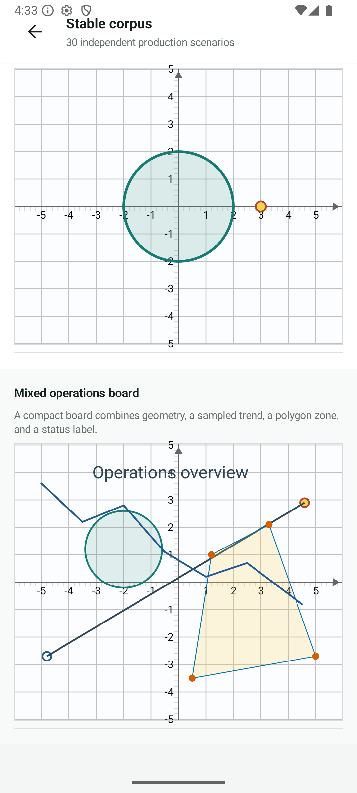 | 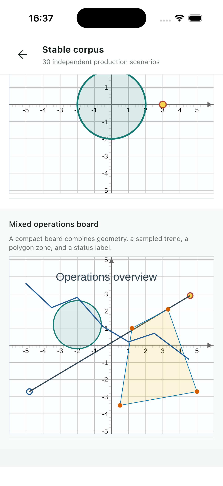 |

| Web |
| :---: |
| 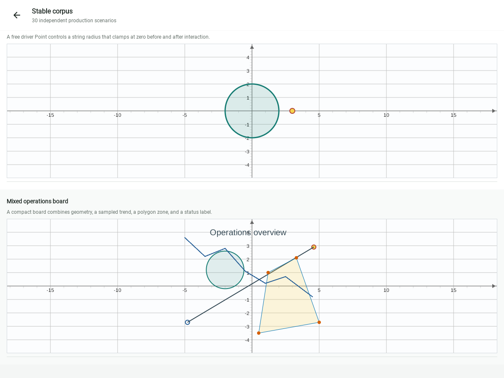 |

The Desktop run has machine-readable process evidence but no current screenshot
because macOS screen-recording permission prevented window capture.

## Build, Publication, And Safety

The final gate covers:

- all tests for `jsxgraph-core`, `jsxgraph-compose`, and
  `jsxgraph-debug-ui`;
- Android debug/release APKs;
- Desktop distributable;
- Web production distribution;
- iOS Arm64, Simulator Arm64, and X64 compilation plus the iOS sample;
- production POM coordinates and MIT metadata;
- production JAR, AAR, KLIB, and resource-ZIP archive safety;
- generated-corpus drift;
- public-source and credential patterns;
- Android debug/release APK permissions.

Production publication coordinates are:

```text
com.swithun:jsxgraph-core:0.1.0
com.swithun:jsxgraph-compose:0.1.0
```

`jsxgraph-debug-ui` is not published as a production module. The Android
sample's debug and release APKs do not declare
`android.permission.INTERNET`. The official JSXGraph distribution, WebView,
and iframe adapters remain isolated in debug UI and are absent from the
production module dependency graph. The publication archive audit verifies 14
POMs and 38 archives. KLIB source metadata is normalized relative to the
repository root, so published iOS and Wasm artifacts do not expose local
developer paths.

The security review of this change set found no attacker-controlled path to a
command, filesystem, XML, browser-HTML, authentication, cryptographic, or
sensitive-data sink. Build scripts consume source-controlled files and trusted
CI environment values. POM XML parsing rejects document type declarations.

## Reproduce The Report

Use JDK 17 or newer:

```bash
node tools/stability/generate-production-corpus.mjs

./gradlew \
  :jsxgraph-core:allTests \
  :jsxgraph-compose:allTests \
  :jsxgraph-debug-ui:allTests \
  verifyPublicationCoordinates \
  :sample:androidApp:assembleDebug \
  :sample:androidApp:assembleRelease \
  :sample:desktopApp:createDistributable \
  :sample:webApp:wasmJsBrowserDistribution

./gradlew \
  :jsxgraph-core:publishAllPublicationsToBuildRepository \
  :jsxgraph-compose:publishAllPublicationsToBuildRepository
bash tools/verify-publication-archives.sh
```

Serve the Web distribution:

```bash
python3 -m http.server 8093 \
  --directory sample/webApp/build/dist/wasmJs/productionExecutable
```

In another shell:

```bash
CORPUS_SOURCE=production \
BASE_URL=http://127.0.0.1:8093/ \
OUTPUT_DIR=captures/local/stable-production/desktop \
VIEWPORT_WIDTH=1200 \
VIEWPORT_HEIGHT=900 \
npm --prefix tools/visual-parity run capture

CORPUS_SOURCE=production \
INPUT_DIR=captures/local/stable-production/desktop \
MIN_BOARD_SSIM=0.93 \
npm --prefix tools/visual-parity run audit

CORPUS_SOURCE=production \
BASE_URL=http://127.0.0.1:8093/ \
OUTPUT_DIR=captures/local/stable-production/compact \
VIEWPORT_WIDTH=390 \
VIEWPORT_HEIGHT=844 \
npm --prefix tools/visual-parity run capture

CORPUS_SOURCE=production \
INPUT_DIR=captures/local/stable-production/compact \
MIN_BOARD_SSIM=0.93 \
npm --prefix tools/visual-parity run audit

BASE_URL=http://127.0.0.1:8093/ \
OUTPUT_DIR=captures/local/web-load/current \
npm --prefix tools/visual-parity run test:load
```

The capture command rejects missing/nontrivial Native Canvas and Official SVG
output plus browser errors. The audit compares board crops with FFmpeg SSIM.
The contact-page generator verifies every expected pair before producing the
paged evidence images.
